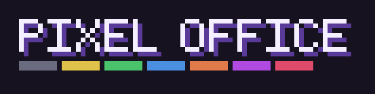
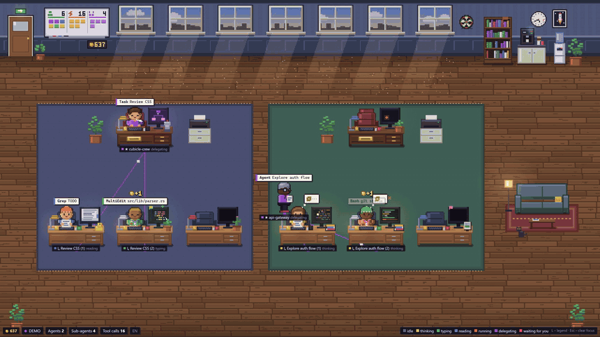
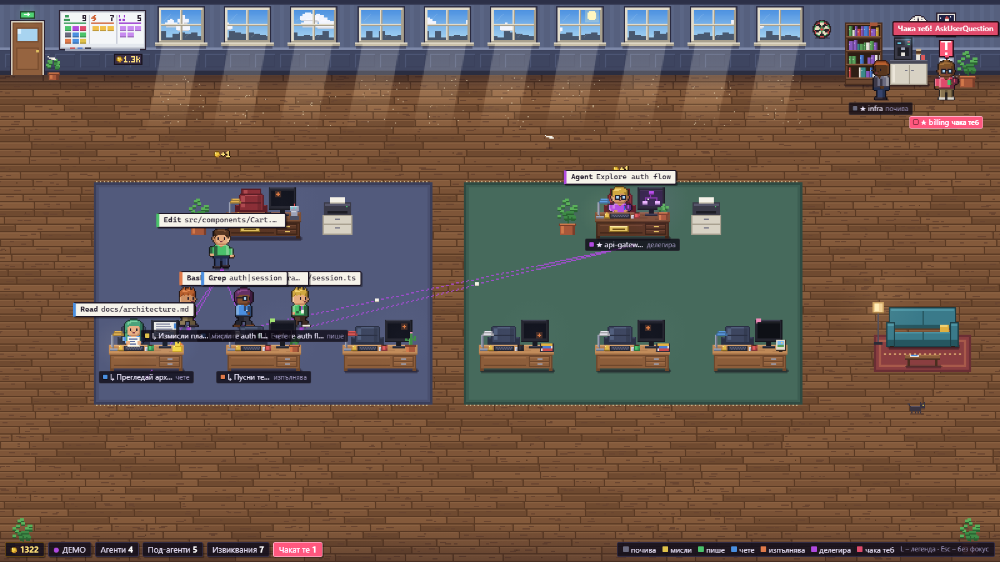
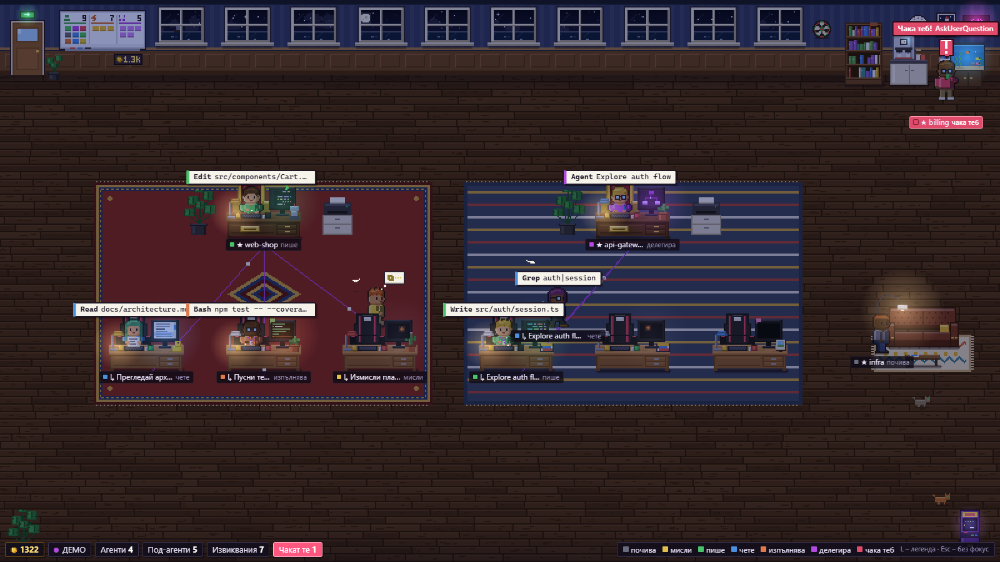

<div align="center">



### Your Claude Code agents, living in a tiny pixel-art office.

Every Claude Code session becomes a coworker at a desk. Sub-agents walk in through the door, pick up the task
and sit down with their team. When someone needs you, the whole room lets you know.

[**▶ Watch the trailer**](docs/media/trailer.mp4) · [Quick start](#quick-start) · [Desktop app](#desktop-widget-windows) · [How it works](#how-it-works)

<a href="docs/media/trailer.mp4"></a>

</div>

---

## Why

Claude Code is happiest when it runs a few sessions at once and hands work to sub-agents. That gets hard to follow
from a stack of terminal tabs: who is still busy, who is stuck on a question, who quietly finished ten minutes ago?

Pixel Office reads the session logs Claude Code already writes to `~/.claude/projects` and turns them into a live
scene you can leave open on a second monitor, or pin in the corner of your screen as a widget.

- **One look tells you the state of everything.** Each agent's shirt, monitor glow and name tag take the colour of what it is doing.
- **Delegation you can actually see.** Orchestrators walk over and hand paper to their sub-agents. Dotted lines on the floor show who works for whom.
- **You never miss a question.** An agent waiting on `AskUserQuestion` waves, its tag flashes red, and the desktop app sends a Windows notification.
- **Nothing to set up.** No API keys and no hooks to install. It runs offline and only reads local files.

<p align="center">
  
  
</p>

## Features

| | |
|---|---|
| 🧑‍💻 **Teams** | Each session (orchestrator) gets a lead desk with a ★ nameplate, and its sub-agents sit in rows of three below it. Up to two teams work at once. Extra sessions queue in the lounge and swap in when a lead goes idle. |
| 🎨 **7 states** | `idle` · `thinking` · `typing` · `reading` · `running` · `delegating` · `waiting`. Each one has its own poses, monitor content and particles. |
| 🛋️ **Lounge** | Idle sessions grab a coffee, play handheld games on the sofa, doze off or throw darts. There's a cat too. |
| 🌇 **Real sky** | The windows follow your local clock: dawn, golden hour, night. Lamps, monitors and the neon sign glow after dark. |
| 🪙 **Tokens & shop** | Active agents earn tokens. Spend them on ~50 decor items: floors, walls, rugs, sofas, a throne for the lead, a neon sign, an aquarium, an arcade cabinet, a second cat. There are also 14 achievements. |
| 🧍 **Your avatar** | Pick the skin, hair and glasses of your own character: the first orchestrator in the office. Everyone else stays random. |
| 🖥️ **Desktop widget** | A frameless, always-on-top Windows app above the tray, with a tray menu, `Ctrl+Alt+P`, notifications and start with Windows. |
| 🧩 **Moddable art** | Everything is drawn in code, but you can replace it with your own PNG character sheet and tileset without touching any code. |

## Quick start

Requires **Node.js 18+**.

```bash
git clone https://github.com/rezored/pixel-office.git
cd pixel-office
npm install
npm start            # → http://localhost:4317
```

Open the page and start a Claude Code session anywhere. Its coworker walks in through the door.

No sessions running? Try the built-in simulations:

| URL | What you get |
|---|---|
| `/?demo` | Live simulation: two teams delegating, sessions coming and going, every state |
| `/?demo=showcase` | A frozen showcase with two teams, two queued sessions and all 7 states at once (good for screenshots) |
| `/?demo&agents=1` | Simulation with a single orchestrator |
| `/?time=22:30` | Fake the clock to see the office at night |
| `/?debug` | FPS, layout info and a log of the last events |
| `/?atlas=6` | Every generated character sprite at ×6 |

Environment variables: `PORT` (default `4317`), `CLAUDE_PROJECTS_DIR` (default `~/.claude/projects`),
`CLAUDE_SESSIONS_DIR`, `PIXEL_OFFICE_HOME` (where the save file lives, default `~/.pixel-office`).
`npm run debug` prints every parsed event and how each sub-agent was linked to its parent.

**Controls:** hover a character for details, click to focus it (spotlight and info card), `L` toggles the legend,
`B` opens the shop and `Esc` clears the focus.

## Desktop widget (Windows)

```bash
npm run desktop      # run the Electron app from source
npm run dist         # build the installer → release/PixelOffice-Setup-<version>.exe
```

The widget runs its own server, so you don't need a browser or `npm start`. It sits in the bottom-right corner above
the tray and stays on top of other windows. Hover it to show a drag bar with settings, pin, click-through, hide and
quit buttons. It widens itself when a second team shows up.
`Ctrl+Alt+P` shows or hides it from anywhere. The tray menu has notifications, start with Windows, demo mode and size reset.

The installer isn't code-signed, so SmartScreen will warn you on first run. Click **More info → Run anyway**.

## How it works

```
~/.claude/projects/**/*.jsonl  ──tail──▶  server.js  ──WebSocket──▶  browser / Electron
~/.claude/sessions/<pid>.json  ──poll──▶     │                         │
                                         wallet.js                  canvas scene
                                  (~/.pixel-office/save.json)     (vanilla ES modules)
```

- **Server** (`server.js`): polls transcripts touched in the last hour and turns each line into small events
  (`tool_start`, `tool_end`, `say`, `user_prompt`). It links sub-agents to their parent through
  `subagents/agent-<id>.meta.json` first, then the session id, then a timing heuristic. It also reads
  `~/.claude/sessions` to know which sessions are still open. Old history isn't replayed on start.
- **Tool → state:** `Edit`/`Write` → typing, `Read`/`Grep`/`WebFetch` → reading, `Bash` → running,
  `Task`/`Agent` → delegating, `AskUserQuestion` → waiting. 8 seconds of silence → idle, unless Claude Code still reports the session as busy (it's thinking or writing a long reply). You can change the mapping in `public/rules.js`.
- **Client** (`public/`): plain ES modules with no build step. The scene is drawn on a low-resolution canvas and scaled
  up by whole device pixels, so it stays crisp at any DPI. All text is HTML laid over the canvas.
- **Tokens:** earned on the server every 5 seconds: about 1 per active orchestrator minute, half for sub-agents,
  plus bonuses for finished tasks. Even if several Pixel Office windows are open, only one of them counts.
  The save file is written atomically and keeps a backup.

The WebSocket protocol and module map are documented in [`CLAUDE.md`](CLAUDE.md). The token economy and shop design
are in [`docs/gamification.md`](docs/gamification.md).

## Custom sprites

Drop PNGs into `public/sprites/` and reload the page:

- **`characters.png`**: 24×32 cells, one row per pose in the order of `POSE_ORDER` in `sprites.js` (open `/?atlas` to get a ready-made template).
  Paint the shirt in the key colours `#ff80ff` / `#ff00ff` / `#a000a0` and they get recoloured with the state colour.
- **`tiles.png` + `tiles.json`**: map `name → {x, y, w, h}` for furniture and floors (`desk`, `chair`, `monitor`, `sofa_back`, …).
  For a shop item that isn't the default, use `name@itemId` (for example `sofa_back@sofa.chesterfield`). Anything you don't provide stays procedural.

## Known limitations

- The UI text is currently in **Bulgarian**. All strings live in one object (`T` in `public/config.js`), so a translation is easy to add.
- The JSONL transcript format isn't an official API. If parsing ever breaks, `npm run debug` shows what's happening.
- Without the session status (older Claude Code versions), an agent counts as idle after 8 seconds without new transcript lines, so long thinking looks like a break.
- `waiting` only comes from `AskUserQuestion`. Tool permission prompts don't show up in the transcript.
- The installer only targets Windows x64 for now. The browser version runs anywhere Node does.

## Tech

Node.js, the [`ws`](https://github.com/websockets/ws) library and Electron for the desktop build. That's all.
There are no image assets, fonts, CDNs or frameworks: every pixel, from the characters to the aquarium fish, is drawn in code.


## License

[MIT](LICENSE) © Kalin Dimitrov

<sub>Not affiliated with Anthropic. "Claude" and "Claude Code" are trademarks of Anthropic.</sub>
